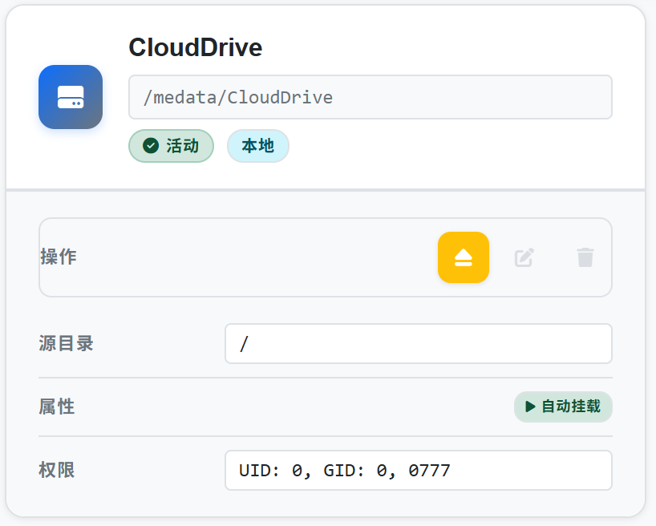
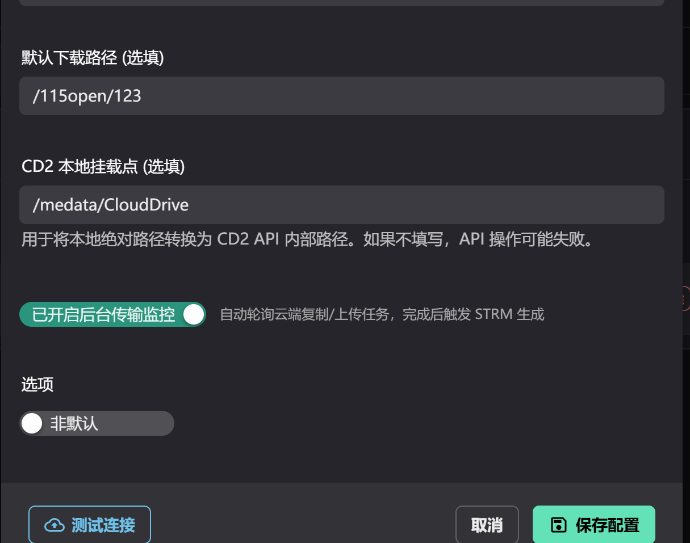
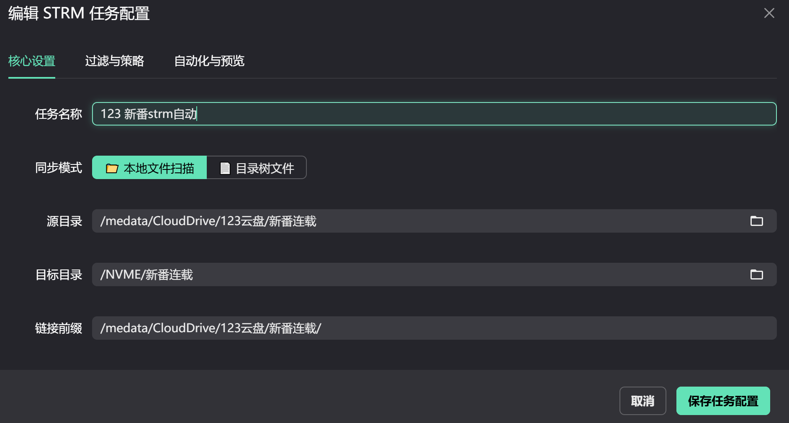
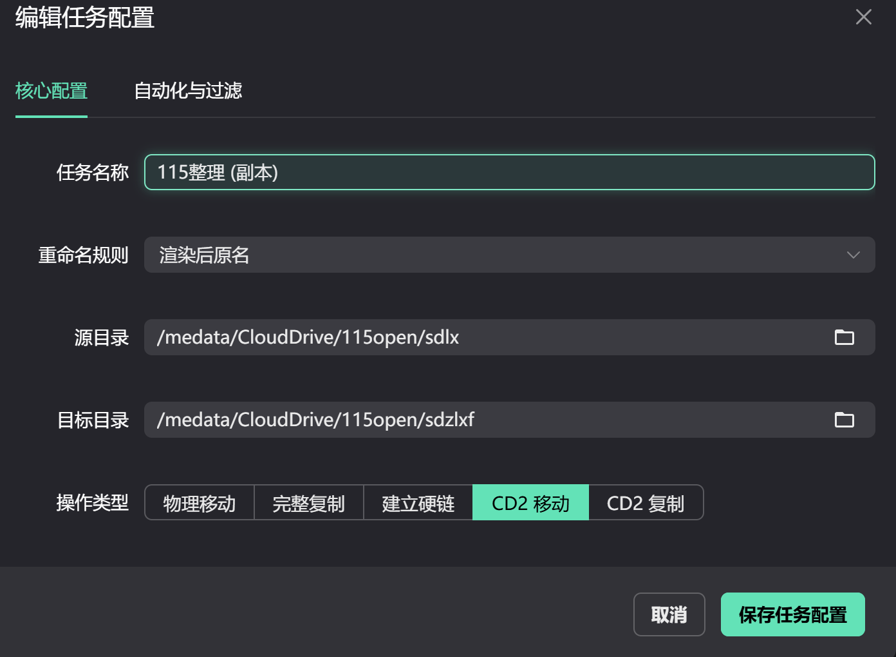

# 设置说明

## CD2挂载设置教程

### CloudDrive2 容器挂载配置

在使用CloudDrive2（CD2）时，需要正确配置容器挂载，以确保其他容器能够访问CD2挂载的网盘文件。

#### Docker Compose 配置

在CD2的docker-compose.yml中，需要添加两条挂载规则：

```yaml
volumes:
  # 第一条：给CD2的compose使用（shared模式）
  - /vol1/1000/NVME/docker2/clouddrive2-19798/medata:/medata:shared

  # 第二条：其他需要挂载CD2的容器使用（rslave模式）
  - /vol1/1000/NVME/docker2/clouddrive2-19798/medata:/medata:rslave
```

#### 挂载模式说明

- **shared**：CD2容器自身使用，允许挂载传播
- **rslave**：其他容器使用，只接收挂载传播

#### CD2挂载设置示例



### CD2下载器配置

配置CD2下载器以正确访问网盘文件。



### STRM虚拟库配置

在STRM虚拟库中配置网盘文件路径。



### 整理任务网盘设置

配置整理任务中的网盘路径映射。


