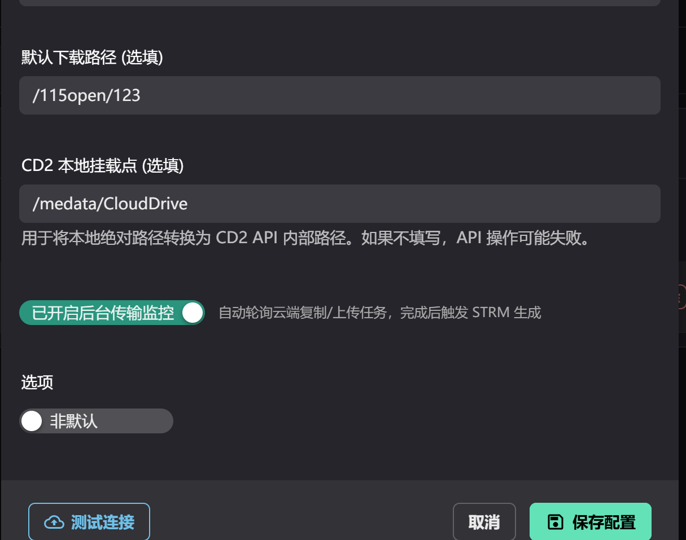
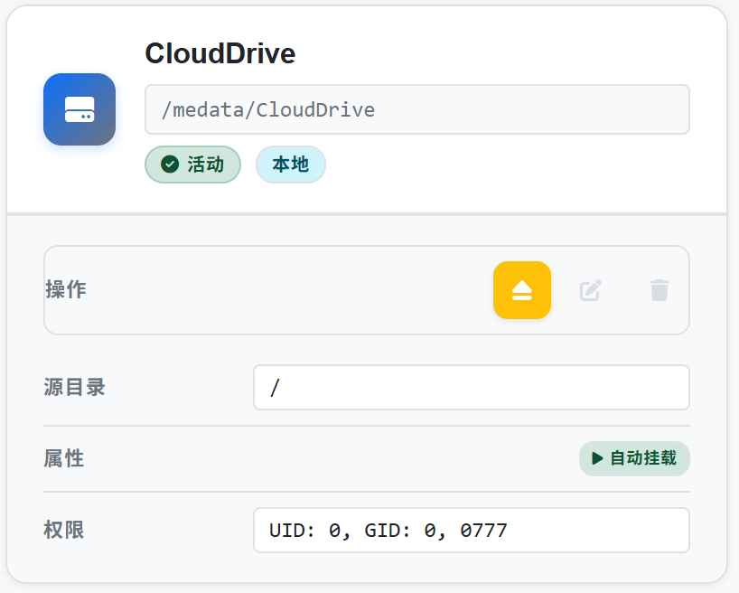
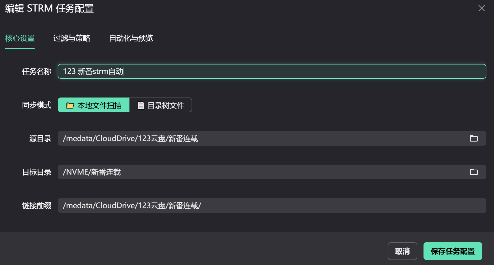
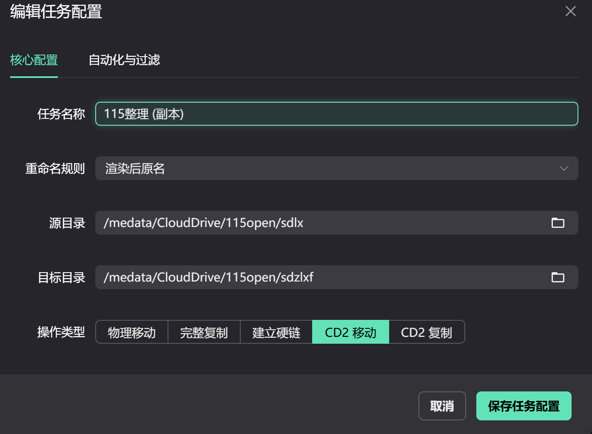

# 设置说明

## CD2 (CloudDrive2) 设置教程

### 一、CD2 下载器配置（gRPC 连接）

番剧管家通过 CloudDrive2 的 **gRPC 接口** 与 CD2 深度集成。在 **[系统设置] → [客户端管理]** 中添加类型为 **CloudDrive2** 的下载器：

| 配置项 | 说明 |
|--------|------|
| 地址 (URL) | CD2 的访问地址，如 `http://192.168.50.12:19798` |
| 用户名 / 密码 | CD2 登录凭据 |
| API Token (选填) | 填写后直接使用 API Token 认证，无需用户名密码 |
| 默认下载路径 (选填) | CD2 云盘路径（如 `/115open/downloads`），作为订阅/下载的默认落点 |
| CD2 本地挂载点 (选填) | 本地挂载视图路径（如 `/medata/CloudDrive`），用于云路径 ↔ 本地路径自动换算；gRPC 免挂载场景选填，本地扫描/Webhook 匹配场景建议填写 |
| 后台传输监控 | 开启后轮询 CD2 传输任务状态，完成后自动触发 STRM 生成与通知 |
| 监控间隔 (秒) | 传输监控的轮询周期 |



### 二、免挂载 gRPC 能力

配置好 CD2 下载器后，以下功能全部通过 gRPC 接口完成，**无需将网盘挂载到本地**：

*   **STRM 免挂载同步**：STRM 任务「同步模式」选择 **CD2 云盘 (gRPC)**，源目录直接填云路径（详见「使用指南 → 虚拟库 (STRM)」）
*   **免挂载云整理**：整理任务源/目标目录类型选择「CD2 云盘」：云 → 云走服务器端移动/复制，云 → 本地走 CD2 下载接口直接下载，本地 → 云走 Remote Upload 上传
*   **云端单文件识别**：在 CD2 管理中心「文件浏览」中可直接对云端文件识别并整理式重命名
*   **云端哈希计算**：通过 CD2 API 流式取流计算 SHA1/ED2K，无需落盘
*   **离线下载管理**：磁力/种子推送到网盘离线下载，任务列表/配额/删除管理
*   **CD2 管理中心**：[CD2] 页面的文件浏览、传输监控、深度删除、协议管理（gRPC proto 自动下载编译）

### 三、CD2 容器挂载配置（按需）

以下场景仍需要将 CD2 挂载到本地，并正确配置容器挂载传播：

*   STRM / 整理任务使用「本地文件扫描」模式读取挂载目录中的文件
*   Emby / Jellyfin 等播放器需要直接读取挂载路径中的媒体文件播放
*   Webhook 联动「本地文件扫描」模式的 STRM 任务（需要按挂载点换算路径）

#### CloudDrive2 容器挂载配置

在使用CloudDrive2（CD2）时，需要正确配置容器挂载，以确保其他容器能够访问CD2挂载的网盘文件。

#### Docker Compose 配置

在CD2的docker-compose.yml中，需要添加两条挂载规则：

```yaml
volumes:
  # 第一条：给CD2的compose使用（shared模式）
  - /vol1/1000/NVME/docker2/clouddrive2-19798/medata:/medata:shared

  # 第二条：其他需要挂载CD2的容器使用（rslave模式）
  - /vol1/1000/NVME/docker2/clouddrive2-19798/medata:/medata:rslave
```

#### 挂载模式说明

- **shared**：CD2容器自身使用，允许挂载传播
- **rslave**：其他容器使用，只接收挂载传播

#### CD2挂载设置示例



### STRM虚拟库配置

在STRM虚拟库中配置网盘文件路径。



### 整理任务网盘设置

配置整理任务中的网盘路径映射。


